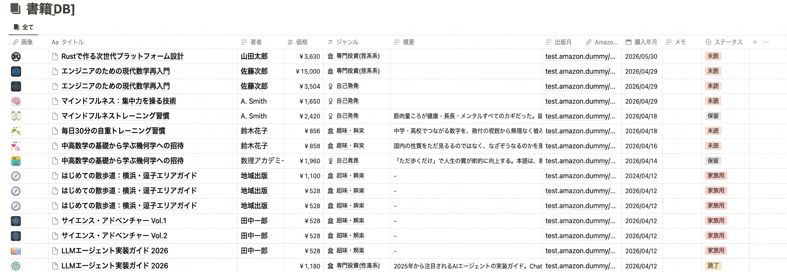

# book_register

ISBNを入力すると、[OpenBD](https://openbd.jp/) から書誌情報を取得して Notion データベースに自動登録する CLI ツール。

## 使い方

```sh
# ISBNを直接指定（複数可）
book_register 9784478039670 9784798067278

# 購入日を指定（省略時は空で登録）
book_register -d 2026-03-15 9784478039670

# ISBNリストファイルを指定（1行1ISBN、# でコメント）
book_register -f isbn_list.txt

# ドライラン（Notion には送らず、取得結果と送信予定 JSON を標準出力のみ）
book_register --dry-run 9784478039670
```

対応 ISBN 形式: ISBN-13（ハイフン有無）・ISBN-10（ハイフン有無・X チェックディジット）

---

## セットアップ

### 1. Notion の準備

#### インテグレーションの作成

[My integrations](https://www.notion.so/my-integrations) でインテグレーションを作成し、API キーを取得する。

#### データベースの構成

下記はデータベースの構成サンプル。✅ のプロパティはこのツールが自動入力する。それ以外は手動で管理する項目で、用途に応じて自由に追加・変更してよい。



| プロパティ名 | 型       | 自動入力 |
|------------|---------|:------:|
| 画像        | URL      | ✅ |
| 名前        | タイトル  | ✅ |
| 代表著者    | テキスト  | ✅ |
| 価格        | 数値     | ✅ |
| ジャンル    | セレクト  | — |
| 概要        | テキスト  | ✅ |
| 出版月      | テキスト  | ✅ |
| AmazonURL  | URL      | ✅ |
| 購入年月    | 日付     | ✅（`--date` 指定時。省略時は空） |
| メモ        | テキスト  | — |
| ステータス  | ステータス | — |

データベース ID はブラウザで開いたときの URL `https://www.notion.so/<ID>?v=...` の `<ID>` 部分（32文字）。

### 2. 環境変数の設定

`.env.example` をコピーして `.env` を作成し、値を入力する。

```sh
cp .env.example .env
```

| 変数名 | 必須 | 説明 |
|--------|------|------|
| `NOTION_API_KEY` | 必須 | Notion インテグレーションの API キー |
| `NOTION_DATABASE_ID` | 必須 | 登録先データベースの ID（32文字） |
| `TAX_RATE` | 省略可 | 価格に乗じる税率（省略時: `1.10`） |

> **注意**: `NOTION_API_KEY` は第三者に知られないよう管理してください。漏えいした場合は Notion の [My integrations](https://www.notion.so/my-integrations) から token を再発行してください。

---

## インストール

### バイナリをダウンロードして使う（推奨）

[GitHub Releases](https://github.com/t-tkm/book-register/releases) からビルド済みバイナリを取得する。

| OS      | ファイル名の例                                      |
|---------|---------------------------------------------------|
| macOS   | `book_register-v0.x.x-aarch64-apple-darwin.tar.gz`（Apple Silicon）<br>`book_register-v0.x.x-x86_64-apple-darwin.tar.gz`（Intel） |
| Linux   | `book_register-v0.x.x-x86_64-unknown-linux-gnu.tar.gz` |
| Windows | `book_register-v0.x.x-x86_64-pc-windows-msvc.zip` |

#### macOS / Linux: 展開と実行権限の付与

```sh
tar xzf book_register-*.tar.gz
chmod +x book_register
```

#### macOS: Gatekeeper の解除

インターネット経由でダウンロードしたバイナリは Gatekeeper によりブロックされる。以下のいずれかの方法で解除する。

**方法 1: システム設定から許可する（ターミナル操作が不要）**

1. ターミナルで `./book_register` を実行すると「開発元を確認できないため開けません」というダイアログが出るので、**「完了」** を押す。
2. **「システム設定」**（macOS Ventura 以降）または **「システム環境設定」**（macOS Monterey 以前）を開く。
3. **「プライバシーとセキュリティ」** を選択する。
4. 下にスクロールすると **「"book_register"は開発元を確認できないため、使用がブロックされました」** というメッセージが表示されているので、横の **「このまま開く」** をクリックし、パスワードまたは Touch ID で承認する。
5. ターミナルで再度 `./book_register` を実行すると **「開く」** ボタン付きのダイアログが表示されるので、**「開く」** を押す。

**方法 2: ターミナルコマンドで解除する**

```sh
xattr -d com.apple.quarantine book_register
```

> **確認方法**: `xattr book_register` を実行して何も表示されなければ解除済み。

#### パスの通った場所へ移動（任意）

```sh
mv book_register /usr/local/bin/
```

移動後はどのディレクトリからでも `book_register` コマンドとして呼び出せる。

### ソースからビルドする

Rust 1.94.1 以上が必要。

```sh
cargo build --release
```

---

## アーキテクチャ

```
入力 (ISBN)
    │
    ▼
ISBN 正規化
  ISBN-10 / ISBN-13・ハイフン有無を吸収 → ISBN-13 に統一
    │
    ▼
OpenBD API  https://api.openbd.jp/v1/get?isbn={ISBN-13}
  日本の書籍流通データベース（無料・登録不要）
    │
    ▼
Notion API  https://api.notion.com/v1/pages
  取得した書誌情報をページとして挿入
```

### フィールドマッピング

| Notion プロパティ | 型       | 取得元                                              |
|----------------|---------|-----------------------------------------------------|
| 名前            | タイトル  | `summary.title`                                     |
| 代表著者        | テキスト  | `summary.author`                                    |
| 出版月          | テキスト  | `summary.pubdate`（`YYYYMMDD` / `YYYYMM` → `YYYYMM` に変換）|
| 概要            | テキスト  | `onix.CollateralDetail.TextContent`（データがあれば取得、空の場合は Notion で手動入力） |
| 購入年月        | 日付     | `--date` オプションで指定（省略時は空。Notion GUI で入力）|
| 価格            | 数値     | `onix.ProductSupply.SupplyDetail.Price[].PriceAmount` に `TAX_RATE` を乗じた税込価格 |
| AmazonURL      | URL      | ISBN-13 → ISBN-10 変換後、`https://www.amazon.co.jp/dp/{ISBN-10}/` を生成 |
| 画像            | URL      | `summary.cover`                                     |

---

## 開発

```sh
cargo test          # テスト
cargo fmt           # フォーマット
cargo clippy        # lint
```

### GitHub Actions

- `CI`: `main` への push と Pull Request で `cargo fmt --check`、`cargo clippy`、`cargo test` を実行
- `Release`: `v*` タグ push で Linux / macOS / Windows 向けバイナリをビルドし、GitHub Release にアーカイブを添付

```sh
git tag v0.1.0
git push origin v0.1.0
```

## ライセンス

MIT License
